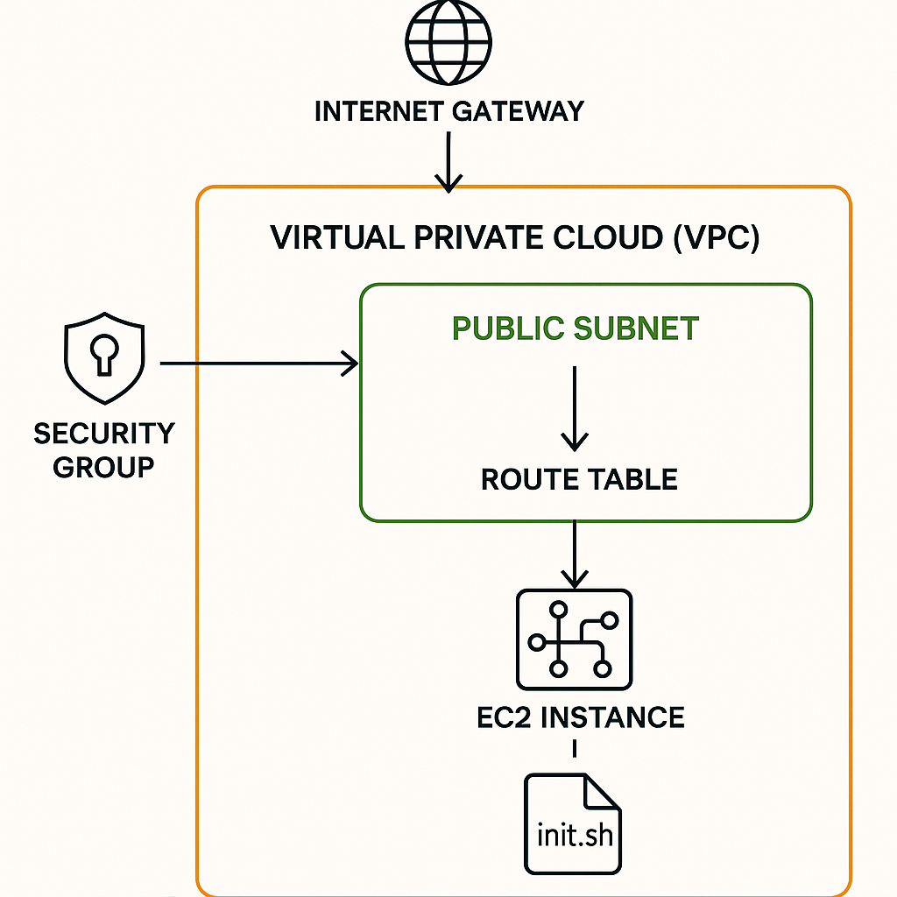

# OSC Deployment with Terraform

This project provisions a basic AWS infrastructure using Terraform. It includes:

- A **Virtual Private Cloud (VPC)** with a public subnet.
- An **Internet Gateway** and **Route Table** for external internet access.
- A **Security Group** allowing inbound SSH (22), HTTP (80), and HTTPS (443) access.
- An **EC2 instance** deployed within the public subnet and associated with the security group.
- User data script (`init.sh`) for instance initialization.

This setup is ideal for basic web server deployments and demonstrations.

